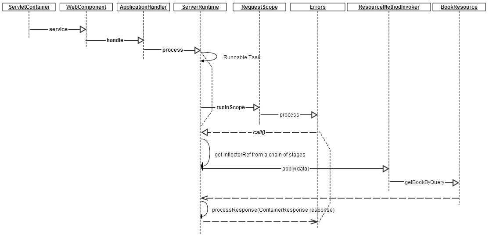
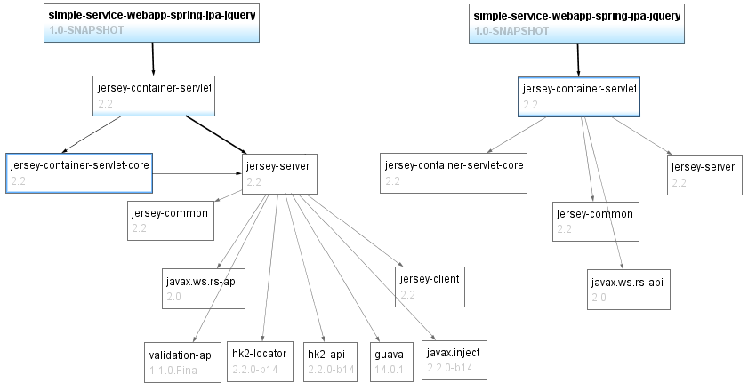
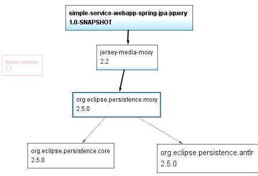

# Jersey2.x对REST请求处理流程的分析 #
一个REST请求，始于客户端/浏览器向REST应用服务器请求一个有效的RESTful Web Service资源的地址，终于服务器返回一个可接受的资源表述(比如JSON)。因此，流程分析的关键点有2个：

- **将请求地址对应到资源类的相应方法上，并触发该方法。**
- **将返回值转换成请求所需要的表述，并返回给客户端。**

我们使用Eclipse的断点调试服务器端(代码对应[本例https://github.com/feuyeux/jax-rs2-guide/](https://github.com/feuyeux/jax-rs2-guide/ "Eric Han's jax-rs2-guide"))，使用cURL脚本作为客户端。

## 1 cURL测试 ##
>curl -H "Accept:application/json" http://localhost:8080/simple-service-webapp-spring-jpa-jquery/webapi/books/book?id=1

该脚本发送了一个REST GET请求，地址是：
>http://localhost:8080/simple-service-webapp-spring-jpa-jquery/webapi/books/book?id=1

对应的服务器端方法是：
>com.example.resource.BookResource.getBookByQuery(Integer)

要求返回的类型是JSON：
>Accept:application/json

## 2 Jersey2.x流程 ##

### 2.1 请求地址到REST方法 ###

#### 2.1.1 ServletContainer.service ####
>ServletContainer.service(HttpServletRequest, HttpServletResponse) line: 248

- **baseUri** http://localhost:8080/simple-service-webapp-spring-jpa-jquery/webapi/
- **requestUri** http://localhost:8080/simple-service-webapp-spring-jpa-jquery/webapi/books/book?id=1

ServletContainer是HttpServlet的子类，位于Jersey容器包(.m2\repository\org\glassfish\jersey\containers\jersey-container-servlet-core\2.2\jersey-container-servlet-core-2.2.jar)。我们知道，Servlet的service方法是请求的入口，作为子类，HTTP任何方法的请求都要先经过该类的service方法。

断点堆栈中，重要的两个变量是请求地址信息的baseUri和requestUri。

*Jersey包依赖关系图*

>ServletContainer.service(URI, URI, HttpServletRequest, HttpServletResponse) line: 372

- **requestContext.header**
{user-agent=[curl/7.26.0], host=[localhost:8080], accept=[application/json]}

在容器层级，请求上下文变量除了包括请求地址信息外，还包括请求头信息。这里我们关注accept信息。

#### 2.1.2 对应方法 ####

>ApplicationHandler.handle(ContainerRequest) line: 982
> 
>ServerRuntime.process(ContainerRequest) line: 211	**final Runnable task**

    new Runnable() {
     public void run() {
      final ContainerRequest data = Stages.process(request, requestProcessingRoot, endpointRef);
      final Endpoint endpoint = endpointRef.get();
- **endpoint	ResourceMethodInvoker  (id=2553)**	
public com.example.domain.Book com.example.resource.BookResource.getBookByQuery(java.lang.Integer)

从上面的代码片段，可以看到请求被对应到了一个Endpoint对象，该对象是一个资源方法Invoker，从断点堆栈中可以看到，其内容就是我们期待的那个方法，此后的invoke将调用这个对应REST请求的处理方法。

#### 2.1.3 调用方法 ####
>ResourceMethodInvoker.invoke(ContainerRequest, Object) line: 353	
 dispatcher.dispatch(resource, requestContext);

>JavaResourceMethodDispatcherProvider$TypeOutInvoker(AbstractJavaResourceMethodDispatcher).invoke(Object, Object...) line: 158	
invokeMethodAction.run();

>ResourceMethodInvocationHandlerFactory$1.invoke(Object, Method, Object[]) line: 81	

从堆栈中可以轻松定位这个方法：**BookResource.getBookByQuery(Integer) line: 71**

到此，请求地址到方法调用的流程就结束了。在处理业务逻辑方法BookResource.getBookByQuery后，Jersey将开始处理响应信息。

### 2.2 REST方法到表述###
>JavaResourceMethodDispatcherProvider$TypeOutInvoker.doDispatch(Object, Request) line: 198

- **o**	Book  (id=2686)
- Response response = Response.ok().entity(o).build();

REST请求的返回信息应包括表述信息和HTTP响应代码(通常一个成功的请求应该得到200 OK)。这就是上面代码所做的事情。在设置好response的entity后，需要将该entity对象转化成请求所接受的表述，流程如下。

#### 2.2.1 写向response ####
>**ServerRuntime$Responder.process(ContainerResponse) line: 351**
>ServerRuntime$Responder.writeResponse(ContainerResponse) line: 486

- **entity** Book  (id=7076)	
- **executor**  WriterInterceptorExecutor  (id=7125)	

从上面的堆栈中可以看到，这个阶段重点的两个对象是返回对象和写处理对象，就是使用后者将前者恰当地写入response中。

#### 2.2.2 JSON表述 ####
REST的表述不局限于JSON，这里我们以JSON作为常用的表述类型为例，来讨论Jersey的表述处理。
Jersey对JSON的支持有4种方式，在第3章会有详细的讲解，本例使用的是EclipseLink项目的MOXy。其底层依赖是JPA的实现之一(另一个著名的JPA实现是JBoss项目下大名鼎鼎的Hibernate)。

		<dependency>
			<groupId>org.glassfish.jersey.media</groupId>
			<artifactId>jersey-media-moxy</artifactId>
			<version>${jersey.version}</version>
		</dependency>

*MOXy依赖关系图*

在下面的堆栈中，可以看到JAXB的身影，因为MOXy同样实现了JAXB，其内部实现是以XML的Marshal方式处理对象(OXM:Object-XML-Mapping)，然后转化为JSON数据(XML-2-JSON)。

>JsonWithPaddingInterceptor.aroundWriteTo(WriterInterceptorContext) line: 91
>	
WriterInterceptorExecutor$TerminalWriterInterceptor.aroundWriteTo(WriterInterceptorContext) line: 188	
>
ConfigurableMoxyJsonProvider(MOXyJsonProvider).**writeTo**(Object, Class<?>, Type, Annotation[], MediaType, MultivaluedMap<String,Object>, OutputStream) line: 782

- **object**		Book  (id=7076)	
- **type**	Class<T> (com.example.domain.Book) (id=568)	
- **genericType**	Class<T> (com.example.domain.Book) (id=568)	
- **annotations**	Annotation[3]  (id=7098)	
- **mediaType**	AcceptableMediaType  (id=7120)	
- **httpHeaders**	StringKeyIgnoreCaseMultivaluedMap<V>  (id=7121)	
- **entityStream**	CommittingOutputStream  (id=7124)	

(*see [Entity Providers](sample\3\document\EntityProviders.md)*)

开始从对象转化为JSON：

>JAXBMarshaller.marshal(Object, OutputStream) line: 395

- **object** 	Book  (id=7076)	
- **outputStream**	CommittingOutputStream  (id=7124)

>XMLMarshaller(XMLMarshaller<ABSTRACT_SESSION,CONTEXT,DESCRIPTOR,MEDIA_TYPE,NAMESPACE_PREFIX_MAPPER,OBJECT_BUILDER>).marshal(Object, **OutputStream**, ABSTRACT_SESSION, DESCRIPTOR) line: 852
>
XMLMarshaller(XMLMarshaller<ABSTRACT_SESSION,CONTEXT,DESCRIPTOR,MEDIA_TYPE,NAMESPACE_PREFIX_MAPPER,OBJECT_BUILDER>).marshal(Object, **Writer**, ABSTRACT_SESSION, DESCRIPTOR) line: 1031	
 
- **object**	 Book  (id=7305)	
- **writer** OutputStreamWriter  (id=7310)	
->	BufferedWriter  (id=7333)	

>XMLMarshaller(XMLMarshaller<ABSTRACT_SESSION,CONTEXT,DESCRIPTOR,MEDIA_TYPE,NAMESPACE_PREFIX_MAPPER,OBJECT_BUILDER>).marshal(Object, **MarshalRecord**, ABSTRACT_SESSION, DESCRIPTOR, boolean) line: 583	

- **object** 	Book  (id=7305)	
- **marshalRecord**	JSONWriterRecord  (id=7342)	
- **session**	DatabaseSessionImpl  (id=7351)	
- **descriptor** 	XMLDescriptor  (id=7353)	
- **isXMLRoot**	false	

几经辗转，写入对象变成了MarshalRecord。

>JSONWriterRecord.startDocument(String, String) line: 171
>	
>TreeObjectBuilder.marshalAttributes(MarshalRecord, Object, CoreAbstractSession) line: 122	
>
>XPathObjectBuilder.marshalAttributes(MarshalRecord, Object, CoreAbstractSession) line: 552	
>

这里是可以想见的流程...

>**ServerRuntime$Responder.processResponse(ContainerResponse) line: 362**

最后是将response返回并释放。流程到此结束。