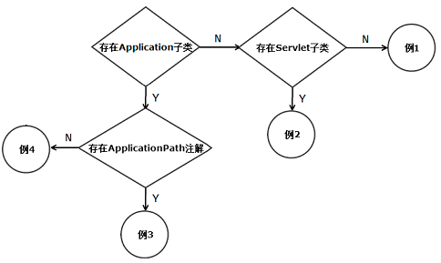

# Java Restful Web Service实战 #
## 2 JAX-RS2快速实现 ##

### 1 第一个Java REST应用 ###

- 0simple-service

### 2 Servlet容器应用 ###

- 0simple-service-webapp-jetty 

### 3 JAX-RS应用的部署 ###

#### 4 例1无Application子类 ####

- 1simple-service-webapp-servlet2-webxml
- 1simple-service-webapp-servlet3-webxml

#### 5 例2有Servlet子类 ####

- 2simple-service-webapp-subservlet

#### 6 例3有ApplicationPath注释 ####

- 3simple-service-webapp-servlet3-application
- 3simple-service-webapp-servlet3-rc

#### 7 例4无ApplicationPath注释 ####

- 4simple-service-webapp-servlet2-application
- 4simple-service-webapp-servlet3-application

#### 8 第一个完整应用 ####

- 5simple-service-webapp-spring-jpa-jquery

[INDEX](/README.md)
