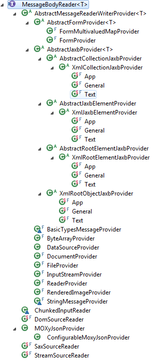
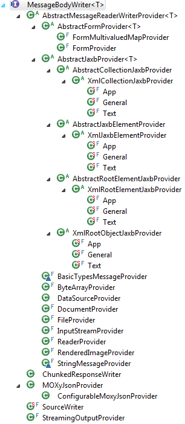

## 1 Providers ##

package javax.ws.rs.ext;

public interface Providers {

getMessageBodyReader

	获取一个匹配一系列请求标准条件的MessageBodyReader实例:	
	剔除MessageBodyReader实例集合中，不支持请求javax.ws.rs.Customers所需的数据类型泛型和媒体类型参数(mediaType)的实例
	在匹配的列表中，按照javax.ws.rs.Consumes (x/y > x/* > */*)优先级排序
	遍历列表，触发实例的isReadable(Class, Type, Annotation[], MediaType) 方法，返回第一个支持请求标准的实例
	遍历结束，返回null

    <T> MessageBodyReader<T> getMessageBodyReader(Class<T> type, 
                                                  Type genericType,
                                                  Annotation[] annotations,
                                                  MediaType mediaType);

getMessageBodyWriter

	获取一个匹配一系列请求标准条件的MessageBodyWriter实例:	
	剔除MessageBodyWriter实例集合中，不支持请求javax.ws.rs.Produces所需的数据类型泛型和媒体类型参数(mediaType)的实例
	在匹配的列表中，按照javax.ws.rs.Produces (x/y > x/* > */*)优先级排序
	遍历列表，触发实例的isWriteable(Class, Type, Annotation[], MediaType) 方法，返回第一个支持请求标准的实例
	遍历结束，返回null

    <T> MessageBodyWriter<T> getMessageBodyWriter(Class<T> type,
                                                  Type genericType, 
                                                  Annotation[] annotations, 
                                                  MediaType mediaType);

getExceptionMapper

	获取一个特定类的异常处理provider，ExceptionMapper的实例：
	该provider的泛型类型最接近其type的父类
    <T extends Throwable> ExceptionMapper<T> getExceptionMapper(Class<T> type);
getContextResolver

	获取一个特定上下文类型和媒体类型的ContextResolver实例：
	剔除MessageBodyWriter实例集合中，不支持请求javax.ws.rs.Produces所需的上下文类型泛型和媒体类型参数(mediaType)的实例
	如果只有一个resolver匹配，直接返回该实例
	否则，在匹配的列表中，按照javax.ws.rs.Produces (x/y > x/* > */*)优先级排序
	遍历列表，触发实例的getContext(java.lang.Class)方法，返回第一个返回值非空的ContextResolver实例
	遍历结束，返回null
    <T> ContextResolver<T> getContextResolver(Class<T> contextType,
                                              MediaType mediaType);
}

## 2 Default Jersey Entity Providers ##

	- byte[] (*/*)
	- String (*/*)
	- InputStream (*/*)
	- Reader (*/*)
	- File (*/*)
	- DataSource (*/*)
	- Source (text/xml, application/xml and media types of the form application/*+xml)
	- JAXBElement (text/xml, application/xml and media types of the form application/*+xml)
	- MultivaluedMap<K,V> (application/x-www-form-urlencoded)
	- Form (application/x-www-form-urlencoded)
	- StreamingOutput ((*/*)) this class can be used as an lightweight MessageBodyWriter<T> that can be returned from a resource method
	- Boolean, Character and Number (text/plain) corresponding primitive types supported via boxing/unboxing conversion

## 3 MessageBodyReader ##
反序列化XML为POJO

### MessageBodyReader.isReadable ###

    public boolean isReadable(Class<?> type, Type genericType,
                              Annotation[] annotations, MediaType mediaType);

- **type** @Consumes的原生类型
- **genericType** @Consumes的泛型类型
- **annotations** 请求中包含的注释数组
- **mediaType** @Consumes的媒体类型，默认为application/octet-stream

### MessageBodyReader.readFrom ###

	public T readFrom(Class<T> type, Type genericType,
                      Annotation[] annotations, MediaType mediaType,
                      MultivaluedMap<String, String> httpHeaders,
                      InputStream entityStream) throws java.io.IOException, javax.ws.rs.WebApplicationException;

- **t** 输入对象
- **type** 输入对象类型
- **genericType** 输入对象的泛型 
- **annotations** 请求中包含的注释数组
- **mediaType** HTTP实体媒体类型
- **httpHeaders** 只读的请求头键值对
- **entityStream** 实体输入流

*注意
在自定义的MessageBodyReader<T>实现中，不要在readFrom方法里关闭实体输入流(entity input stream)*

## 4 MessageBodyWriter ##
序列化POJO为XML

### MessageBodyWriter.isWriteable ###
	public boolean isWriteable(Class<?> type, Type genericType,
                               Annotation[] annotations, MediaType mediaType);

- **type** @Produces的原生类型
- **genericType** @Produces的泛型类型
- **annotations** 请求中包含的注释数组
- **mediaType** @Produces的媒体类型

### MessageBodyWriter.writeTo ###

	public void writeTo(T t, Class<?> type, Type genericType, Annotation[] annotations,
                        MediaType mediaType,
                        MultivaluedMap<String, Object> httpHeaders,
                        OutputStream entityStream)
            throws java.io.IOException, javax.ws.rs.WebApplicationException;

- **t** 输出对象
- **type** 输出对象类型
- **genericType** 输出对象的泛型 
- **annotations** 请求中包含的注释数组
- **mediaType** HTTP实体媒体类型
- **httpHeaders** 请求头键值对
- **entityStream** 实体输出流

*注意
在自定义的MessageBodyWriter<T>实现中，不要在writeTo方法里关闭实体输出流(entity output stream)*

3

## MessageBodyWorkers ##