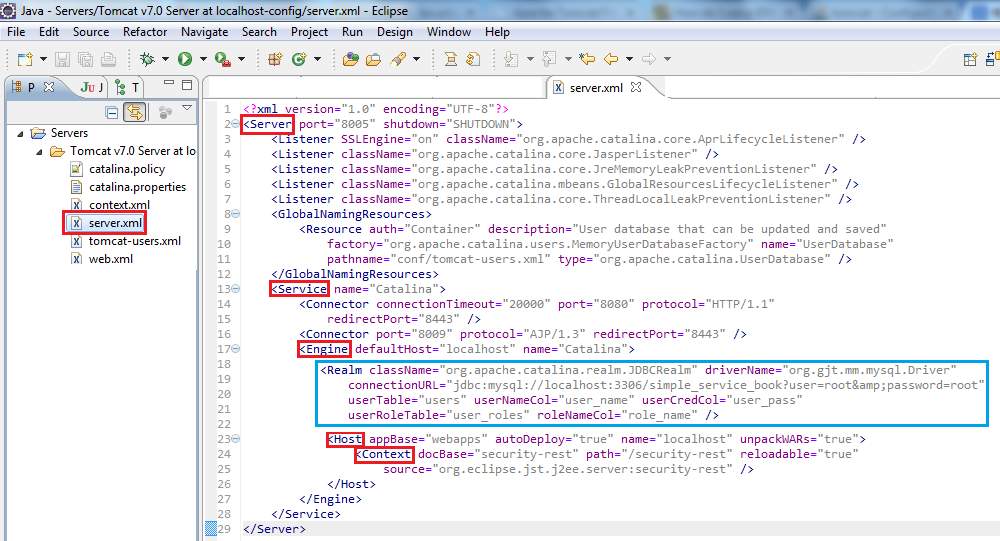
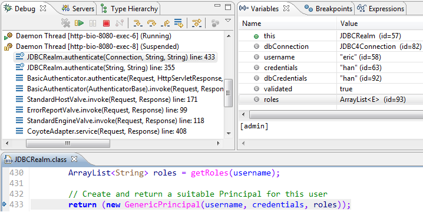
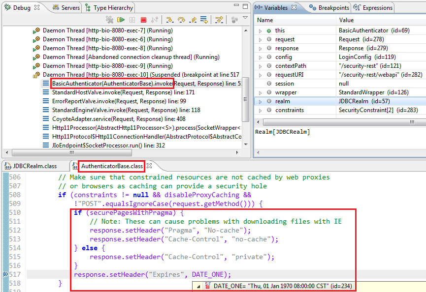
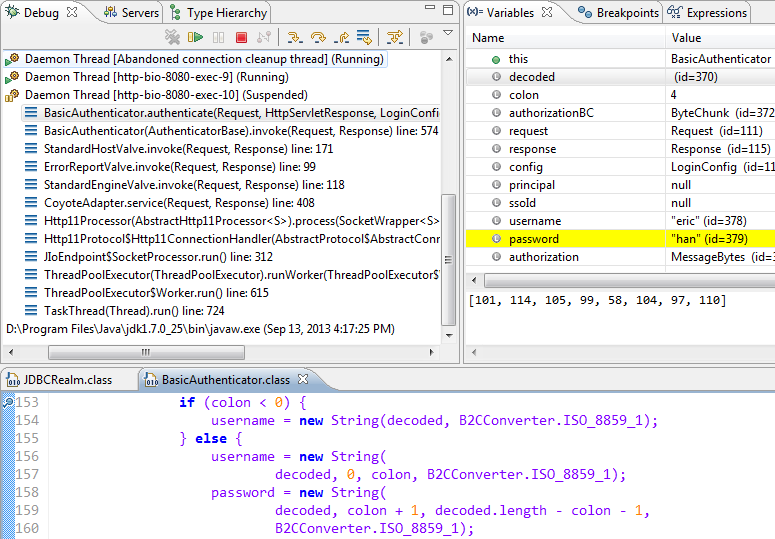
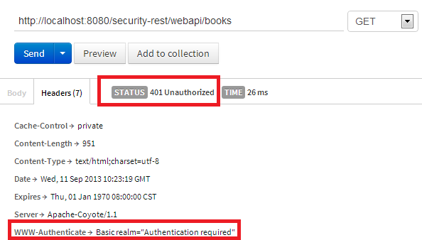
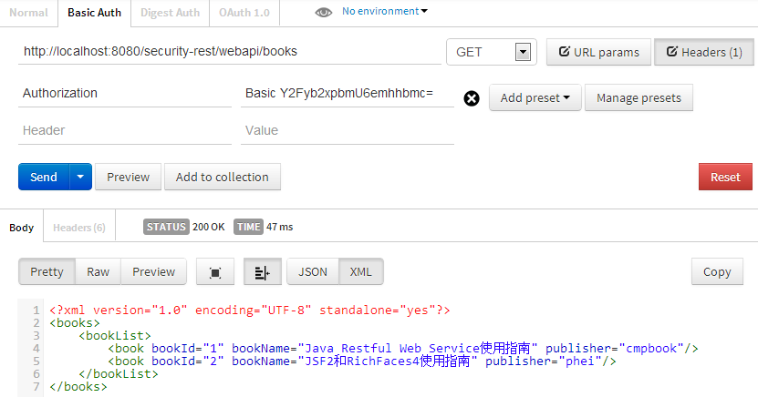
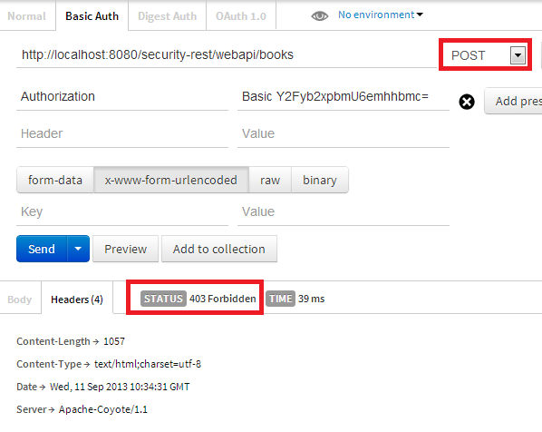
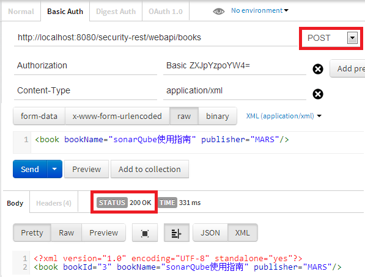

### 1. JDBCRealm + BASIC认证###
- Accesses authentication information stored in a relational database, accessed via a JDBC driver.
- 通过JDBC访问关系型数据库，获取认证信息

#### 1.1 创建Realm所需的数据表 ####
> - 导出 mysqldump simple_service_book -uroot -p security.sql
> - 导入 mysql -uroot -p < security.sql

	DROP DATABASE IF EXISTS `simple_service_book`;
	CREATE DATABASE `simple_service_book`;
	USE `simple_service_book`;
	CREATE TABLE `simple_book` (
	  `BOOKID` int(11) NOT NULL AUTO_INCREMENT,
	  `BOOKNAME` varchar(128) DEFAULT NULL,
	  `PUBLISHER` varchar(128) DEFAULT NULL,
	  PRIMARY KEY (`BOOKID`),
	  UNIQUE KEY `BOOKID` (`BOOKID`)
	) ENGINE=InnoDB DEFAULT CHARSET=utf8;
	LOCK TABLES `simple_book` WRITE;
	INSERT INTO `simple_book` VALUES (1,'Java Restful Web Service使用指南','cmpbook'),
	(2,'JSF2和RichFaces4使用指南','phei');
	UNLOCK TABLES;
	
	CREATE TABLE `user_roles` (
	  `user_name` varchar(15) NOT NULL,
	  `role_name` varchar(15) NOT NULL,
	  PRIMARY KEY (`user_name`,`role_name`)
	) ENGINE=InnoDB DEFAULT CHARSET=utf8;
	LOCK TABLES `user_roles` WRITE;
	INSERT INTO `user_roles` VALUES ('caroline','user'),('eric','admin');
	UNLOCK TABLES;
	
	CREATE TABLE `users` (
	  `user_name` varchar(15) NOT NULL,
	  `user_pass` varchar(15) NOT NULL,
	  PRIMARY KEY (`user_name`)
	) ENGINE=InnoDB DEFAULT CHARSET=utf8;
	LOCK TABLES `users` WRITE;
	INSERT INTO `users` VALUES ('caroline','zhang'),('eric','han');
	UNLOCK TABLES;

#### 1.2 配置JDBCRealm ####
$CATALINA_BASE/conf/server.xml

	<Realm className="org.apache.catalina.realm.JDBCRealm" 
	driverName="org.gjt.mm.mysql.Driver"  
	connectionURL="jdbc:mysql://localhost:3306/simple_service_book?user=root&amp;password=root"
	userTable="users" 
	userNameCol="user_name"
	userCredCol="user_pass"
	userRoleTable="user_roles"
	roleNameCol="role_name"/>
*[http://tomcat.apache.org/tomcat-7.0-doc/config/realm.html](http://tomcat.apache.org/tomcat-7.0-doc/config/realm.html)*

**Eclipse内置Tomcat配置**

#### 1.3 数据库驱动 ####
拷贝Mysql的JDBC驱动到$CATALINA_HOME/lib目录。使用Maven的项目可以从本地仓库取得，否则从网上搜吧。

	M2_REPO/mysql/mysql-connector-java/5.1.25/mysql-connector-java-5.1.25.jar 
	(仓库地址举例：M2_REPO=C:\Users\hanl\.m2\repository)

#### 1.4 配置应用的web.xml ####
/security-rest/src/main/webapp/WEB-INF/web.xml

	<security-constraint>
		<web-resource-collection>
			<url-pattern>/webapi/*</url-pattern>
			<http-method>GET</http-method>
			<http-method>POST</http-method>
			<http-method>UPDATE</http-method>
			<http-method>DELETE</http-method>
		</web-resource-collection>
		<auth-constraint>
			<role-name>admin</role-name>
		</auth-constraint>
	</security-constraint>
	
	<security-constraint>
		<web-resource-collection>
			<url-pattern>/webapi/*</url-pattern>
			<http-method>GET</http-method>
		</web-resource-collection>
		<auth-constraint>
			<role-name>user</role-name>
		</auth-constraint>
	</security-constraint>

	<login-config>
		<auth-method>BASIC</auth-method>
	</login-config>

Tomcat将调用Realm.authenticate()对首次访问的用户进行认证。认证通过后被缓存在Tomcat(对于FORM-based authentication, 直到session失效,对于 BASIC authentication,直到关闭浏览器)

#### 1.5 BASIC认证 ####
C:\Users\hanl\.m2\repository\org\apache\tomcat\tomcat-catalina\7.0.42\tomcat-catalina-7.0.42-sources.jar

Realm.authenticate()

base64(username:password)

#### 1.6 应用权限测试 ####

**测试工具**
[Chrome插件POSTMAN](https://chrome.google.com/webstore/detail/postman-rest-client-packa/fhbjgbiflinjbdggehcddcbncdddomop)

**测试用例1**
>测试地址=http://localhost:8080/security-rest/webapi/books
>
>测试方法=GET
>
>测试用户=无
>
>测试结果=**401 Unauthorized**

**测试用例2**
>测试地址=http://localhost:8080/security-rest/webapi/books
>
>测试方法=GET
>
>测试用户=caroline role=user
>
>测试结果=**200 OK**

**测试用例3**
>测试地址=http://localhost:8080/security-rest/webapi/books
>
>测试方法=POST
>
>测试用户=caroline role=user
>
>测试结果=**403 Forbidden**

**测试用例4**
>测试地址=http://localhost:8080/security-rest/webapi/books
>
>测试方法=POST
>
>测试用户=eric role=admin
>
>测试结果=**200 OK**

