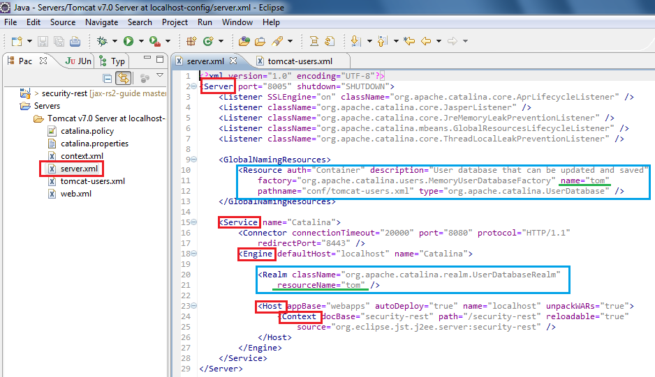
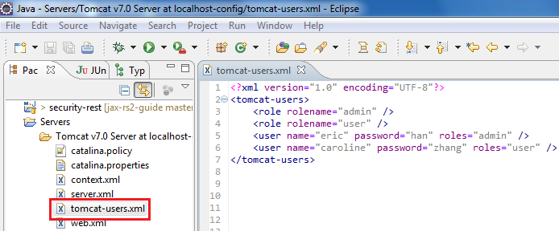
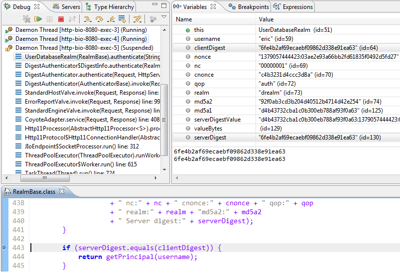

### 3. UserDatabaseRealm + DIGEST认证 ###
 - Accesses authentication information stored in an UserDatabase JNDI resource, which is typically backed by an XML document (conf/tomcat-users.xml).
 - 通过读取XML格式的JNDI资源，获取认证信息

#### 3.1 创建Realm所需的数据表 ####
mysqldump simple_service_book -uroot -p > security.sql

#### 3.2 配置UserDatabaseRealm ####
$CATALINA_BASE/conf/server.xml
	<Resource name="UserDatabase" auth="Container"
	type="org.apache.catalina.UserDatabase"
	factory="org.apache.catalina.users.MemoryUserDatabaseFactory"
	pathname="conf/tomcat-users.xml" />
			  
	<Realm className="org.apache.catalina.realm.UserDatabaseRealm" resourceName="UserDatabase"/> 

**Eclipse内置Tomcat配置**

$CATALINA_BASE/conf/tomcat-users.xml

	<?xml version="1.0" encoding="UTF-8"?>
	<tomcat-users>
		<role rolename="admin" />
		<role rolename="user" />
		<user name="eric" password="han" roles="admin" />
		<user name="caroline" password="zhang" roles="user" />
	</tomcat-users>

**Eclipse内置Tomcat tomcat-users配置**

#### 3.3 数据库驱动 ####
$CATALINA_HOME/lib

M2_REPO/mysql/mysql-connector-java/5.1.25/mysql-connector-java-5.1.25.jar 

#### 3.4 配置应用的web.xml ####
/security-rest/src/main/webapp/WEB-INF/web.xml

	<security-constraint>
		<web-resource-collection>
			<url-pattern>/webapi/*</url-pattern>
			<http-method>GET</http-method>
			<http-method>POST</http-method>
			<http-method>UPDATE</http-method>
			<http-method>DELETE</http-method>
		</web-resource-collection>
		<auth-constraint>
			<role-name>admin</role-name>
		</auth-constraint>
	</security-constraint>
	
	<security-constraint>
		<web-resource-collection>
			<url-pattern>/webapi/*</url-pattern>
			<http-method>GET</http-method>
		</web-resource-collection>
		<auth-constraint>
			<role-name>user</role-name>
		</auth-constraint>
	</security-constraint>

	<login-config>
		<auth-method>DIGEST</auth-method>
	</login-config>

#### 3.5 DIGEST认证 ####
C:\Users\hanl\.m2\repository\org\apache\tomcat\tomcat-catalina\7.0.42\tomcat-catalina-7.0.42-sources.jar

Realm.authenticate()

组合加密、比较都是在服务器端完成的。
md5(md5(username:realm:password):nonce:nc:cnonce:qop:md5(httpmethod:uri))

#### 3.6 应用权限测试 ####
DIGEST认证与BASIC认证的算法不同，但呈现方式相同。都是弹出窗口，让用户输入用户名和口令。