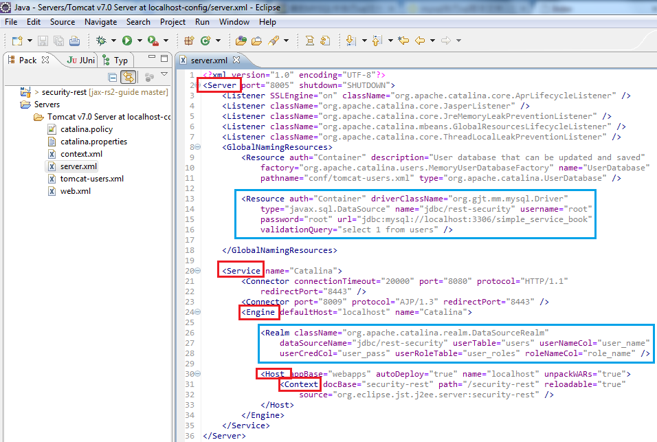
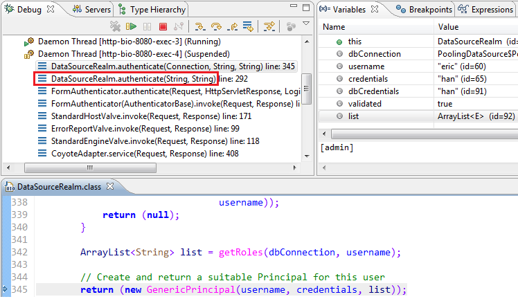

### 2. DataSourceRealm + FORM认证###
 - Accesses authentication information stored in a relational database, accessed via a named JNDI JDBC DataSource.
 - 通过JNDI访问关系型数据库，获取认证信息

#### 2.1 创建Realm所需的数据表 ####
mysql -uroot -p < security.sql

#### 2.2 配置DataSourceRealm ####
$CATALINA_BASE/conf/server.xml
设置DATA SOURCE

	<Resource auth="Container"
	driverClassName="org.gjt.mm.mysql.Driver"
	type="javax.sql.DataSource"
	name="jdbc/rest-security"
	username="root" password="root" 
	url="jdbc:mysql://localhost:3306/simple_service_book"
	validationQuery="select 1 from users"/>

设置DataSourceRealm

	<Realm className="org.apache.catalina.realm.DataSourceRealm"
	   dataSourceName="jdbc/rest-security"
	   userTable="users"
	   userNameCol="user_name"
	   userCredCol="user_pass"
	   userRoleTable="user_roles"
	   roleNameCol="role_name"/>

**Eclipse内置Tomcat配置**

#### 2.3 数据库驱动 ####
拷贝Mysql的JDBC驱动到$CATALINA_HOME/lib目录。使用Maven的项目可以从本地仓库取得，否则从网上搜吧。

	M2_REPO/mysql/mysql-connector-java/5.1.25/mysql-connector-java-5.1.25.jar 
	(仓库地址举例：M2_REPO=C:\Users\hanl\.m2\repository)

#### 2.4 配置应用的web.xml ####
/security-rest/src/main/webapp/WEB-INF/web.xml

	<resource-ref>
		<description>MySQL DB Connection Pool</description>
		<res-ref-name>jdbc/rest-security</res-ref-name>
		<res-type>javax.sql.DataSource</res-type>
		<res-auth>Container</res-auth>
		<res-sharing-scope>Shareable</res-sharing-scope>
	</resource-ref>

	<security-constraint>
		<web-resource-collection>
			<url-pattern>/*</url-pattern>
			<http-method>GET</http-method>
		</web-resource-collection>
		<web-resource-collection>
			<url-pattern>/webapi/*</url-pattern>
			<http-method>GET</http-method>
			<http-method>POST</http-method>
			<http-method>UPDATE</http-method>
			<http-method>DELETE</http-method>
		</web-resource-collection>
		<auth-constraint>
			<role-name>admin</role-name>
		</auth-constraint>
	</security-constraint>

	<security-constraint>
		<web-resource-collection>
			<url-pattern>/*</url-pattern>
			<http-method>GET</http-method>
		</web-resource-collection>
		<web-resource-collection>
			<url-pattern>/webapi/*</url-pattern>
			<http-method>GET</http-method>
		</web-resource-collection>
		<auth-constraint>
			<role-name>user</role-name>
		</auth-constraint>
	</security-constraint>

	<login-config>
		<auth-method>FORM</auth-method>
		<form-login-config>
			<form-login-page>/login.html</form-login-page>
			<form-error-page>/error.html</form-error-page>
		</form-login-config>
	</login-config>

	<welcome-file-list>
		<welcome-file>/index.html</welcome-file>
	</welcome-file-list>

#### 2.5 登录页面 ####
	<form action="j_security_check">
		

			User Name
			<input id="j_username" name="j_username" type="text" />
		

		

			Pass Word
			<input id="j_password" name="j_password" type="password" />
		

		<input type="submit" value="Sign In" />
	</form>

#### 2.6 FORM认证 ####
C:\Users\hanl\.m2\repository\org\apache\tomcat\tomcat-catalina\7.0.42\tomcat-catalina-7.0.42-sources.jar

Realm.authenticate()

#### 2.7 应用权限测试 ####
**测试用例1**
>测试地址=http://localhost:8080/security-rest/
>
>测试方法=FORM j_security_check
>
>测试用户=eric role=admin
>
>测试结果=**302 Found**

**测试用例2**
>测试地址=http://localhost:8080/security-rest/webapi/books
>
>测试方法=POST
>
>测试用户=eric role=admin
>
>测试结果=**200 OK**

**测试用例3**
>测试地址=http://localhost:8080/security-rest/webapi/books
>
>测试方法=POST
>
>测试用户=caroline role=user
>
>测试结果=**403 Forbidden**