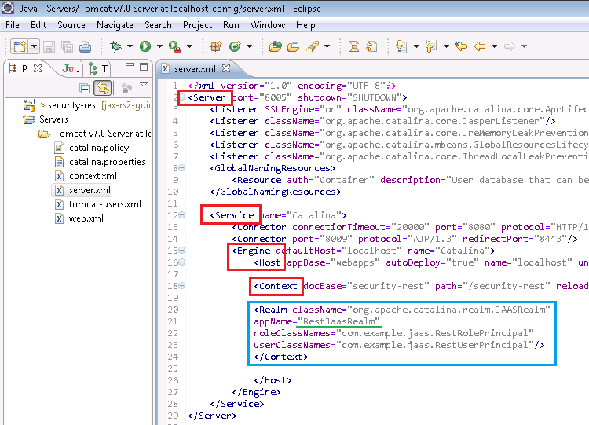
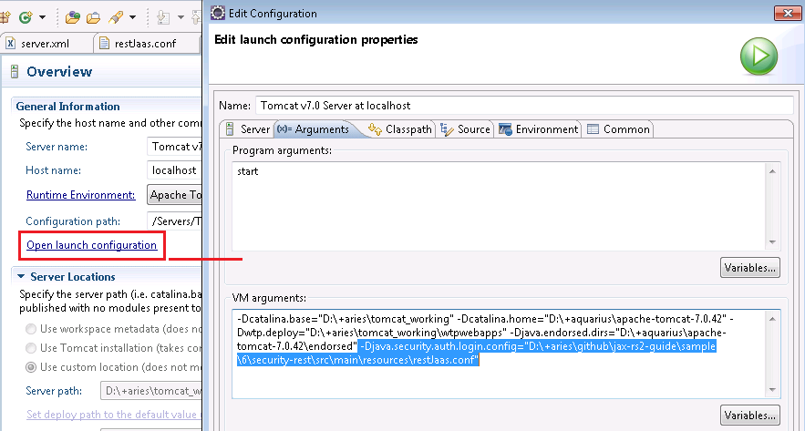
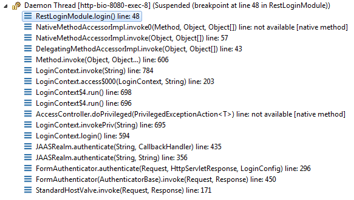
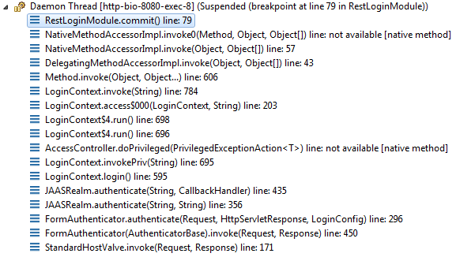

### 4. JAASRealm + FORM认证 ###
 - Accesses authentication information through the Java Authentication & Authorization Service (JAAS) framework.
 - 通过实现JAAS(JSR196标准)的服务，获取认证信息

#### 4.1 创建Realm所需的数据表 ####
mysql -uroot -p < security.sql

#### 4.2 配置JAASRealm ####
$CATALINA_BASE/conf/server.xml

	<Context docBase="security-rest" ……>
		<Realm className="org.apache.catalina.realm.JAASRealm"
		appName="RestJaasRealm"			 
		roleClassNames="com.example.jaas.RestRolePrincipal" 
		userClassNames="com.example.jaas.RestUserPrincipal"/>
	</Context>

Realm定义在context中，否则会导致roleClassNames和userClassNames中定义的类找不到。appName定义的名字和restJaas.conf中定义的须一致。

**Eclipse内置Tomcat配置**

#### 4.3 JAAS配置文件 ####
/security-rest/src/main/resources/restJaas.conf

	RestJaasRealm{
		com.example.jaas.RestLoginModule required;
	};

第二参数取值和含义

- Required 该模块必须认证用户，如果认证失败，使用其它登录模块认证
- Requisite 如果认证失败，将终止认证
- Sufficient 如果认证成功，即获得登录认证；如果认证失败，使用其它登录模块认证
- Optional 认证将继续下去，即使该模块认证成功

#### 4.4 JAAS实现类 ####
[jax-rs2-guide\sample\6\security-rest\src\main\java\com\example\jaas>ls -l](https://github.com/feuyeux/jax-rs2-guide/)

- LoginModule实现类：RestLoginModule.java
- LoginModule实现类的数据库操作类：RestLoginDao.java
- Role接口POJO类：RestRolePrincipal.java
- User接口POJO类：RestUserPrincipal.java

#### 4.5 配置JVM启动参数 ####
	-Djava.security.auth.login.config="D:\+aries\github\jax-rs2-guide\sample\6\security-rest\src\main\resources\restJaas.conf"

**Eclipse内置Tomcat 虚拟机参数设置**

#### 4.6 数据库驱动 ####
$CATALINA_HOME/lib

M2_REPO/mysql/mysql-connector-java/5.1.25/mysql-connector-java-5.1.25.jar 

#### 4.7 配置应用的web.xml ####
/security-rest/src/main/webapp/WEB-INF/web.xml

	<security-constraint>
		<web-resource-collection>
			<url-pattern>/*</url-pattern>
			<http-method>GET</http-method>
			<http-method>POST</http-method>
			<http-method>UPDATE</http-method>
			<http-method>DELETE</http-method>
		</web-resource-collection>
		<web-resource-collection>
			<url-pattern>/webapi/*</url-pattern>
			<http-method>GET</http-method>
			<http-method>POST</http-method>
			<http-method>UPDATE</http-method>
			<http-method>DELETE</http-method>
		</web-resource-collection>
		<auth-constraint>
			<role-name>admin</role-name>
		</auth-constraint>
	</security-constraint>

	<security-constraint>
		<web-resource-collection>
			<url-pattern>/*</url-pattern>
			<http-method>GET</http-method>
		</web-resource-collection>
		<web-resource-collection>
			<url-pattern>/webapi/*</url-pattern>
			<http-method>GET</http-method>
		</web-resource-collection>
		<auth-constraint>
			<role-name>user</role-name>
		</auth-constraint>
	</security-constraint>

	<login-config>
		<auth-method>FORM</auth-method>
		<form-login-config>
			<form-login-page>/login.html</form-login-page>
		</form-login-config>
	</login-config>

	<welcome-file-list>
		<welcome-file>/index.html</welcome-file>
	</welcome-file-list>

#### 4.8 登录页面 ####
	<form action="j_security_check">
		

			User Name
			<input id="j_username" name="j_username" type="text" />
		

		

			Pass Word
			<input id="j_password" name="j_password" type="password" />
		

		<input type="submit" value="Sign In" />
	</form>

#### 4.9 JAAS流程 ####
在JAASRealm.authenticate认证方法中，有两个主要对象：

- CallbackHandler 持有登录信息的回调
- LoginContext 通过配置文件感知LoginModule实现类的上下文

认证分为两个步骤：

- 验证登录信息合法性 对应login方法

- 获取登录身份信息 对应commit方法

