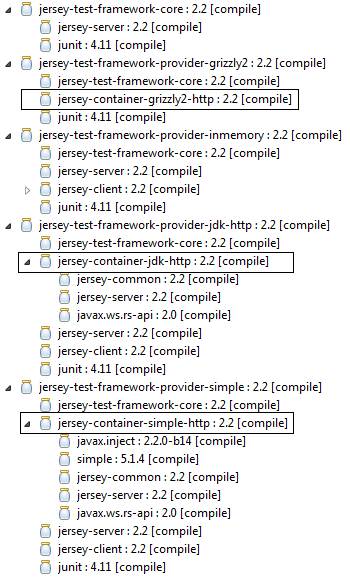

# Java Restful Web Service使用指南 #
## 7 REST测试 ##

JerseyTest

    protected Client getClient(TestContainer tc, ApplicationHandler applicationHandler) {
        ClientConfig cc = tc.getClientConfig();

        if (cc == null) {
            cc = new ClientConfig();
        }

        //check if logging is required
        if (isEnabled(TestProperties.LOG_TRAFFIC)) {
            cc.register(new LoggingFilter(LOGGER, isEnabled(TestProperties.DUMP_ENTITY)));
        }

        configureClient(cc);

        return ClientBuilder.newClient(cc);
    }

Grizzly轻量级HTTP容器是Jersey测试框架的默认容器

	<dependency>
		<groupId>org.glassfish.jersey.test-framework.providers</groupId>
		<artifactId>jersey-test-framework-provider-grizzly2</artifactId>
		<version>${jersey.version}</version>
	</dependency>

测试框架内存容器

	<dependency>
		<groupId>org.glassfish.jersey.test-framework.providers</groupId>
		<artifactId>jersey-test-framework-provider-inmemory</artifactId>
		<version>${jersey.version}</version>
	</dependency>

测试框架JDK版HTTP容器

	<dependency>
		<groupId>org.glassfish.jersey.test-framework.providers</groupId>
		<artifactId>jersey-test-framework-provider-jdk-http</artifactId>
		<version>${jersey.version}</version>
	</dependency>

测试框架简单版HTTP容器

	<dependency>
		<groupId>org.glassfish.jersey.test-framework.providers</groupId>
		<artifactId>jersey-test-framework-provider-simple</artifactId>
		<version>${jersey.version}</version>
	</dependency>

- 参考2 JAX-RS2快速实现 5simple-service-webapp-spring-jpa-jquery

异步测试

- 参考8 REST异步 asyn-rest

[INDEX](/README.md)